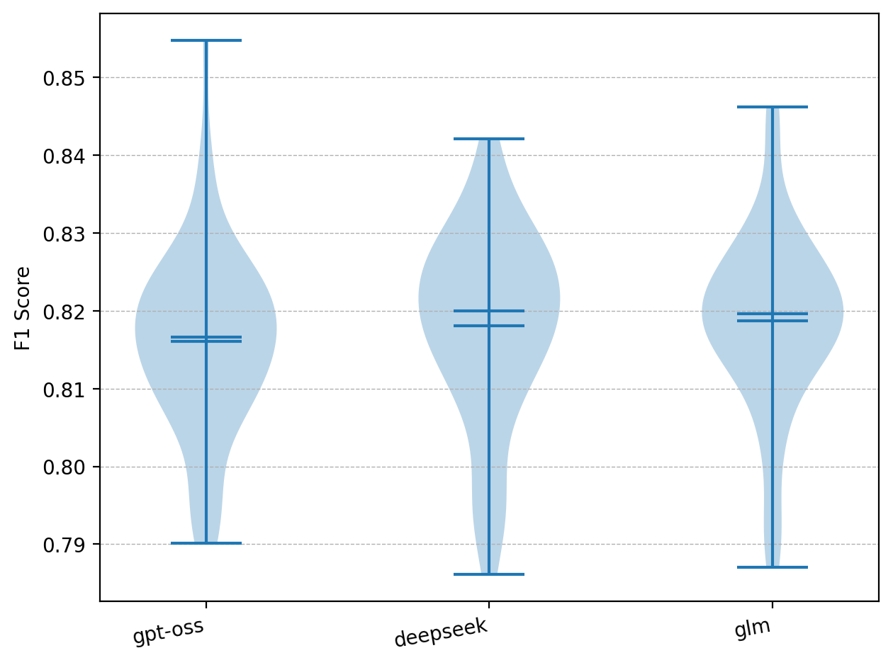
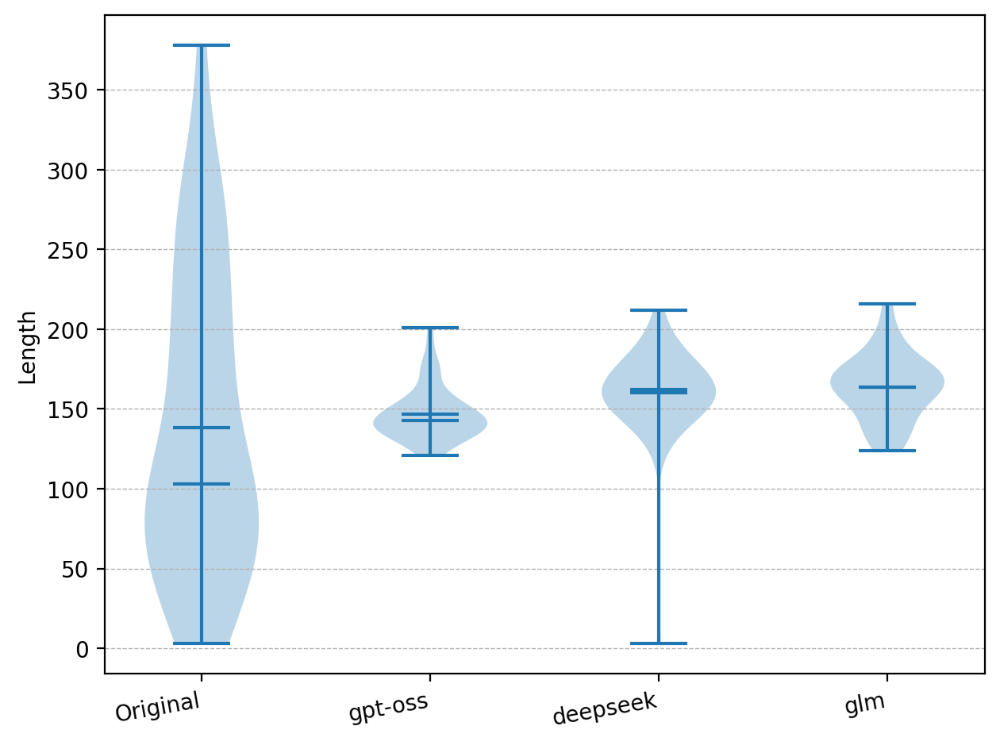
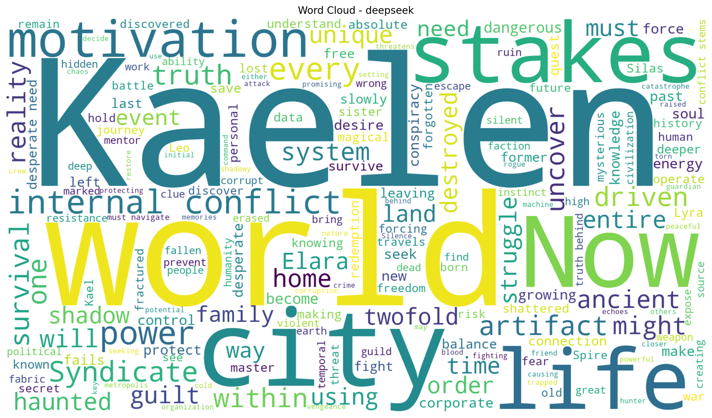
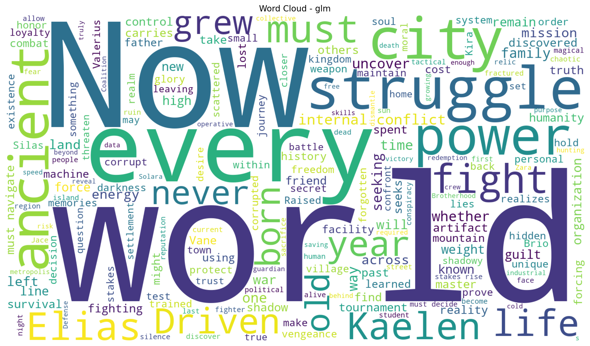
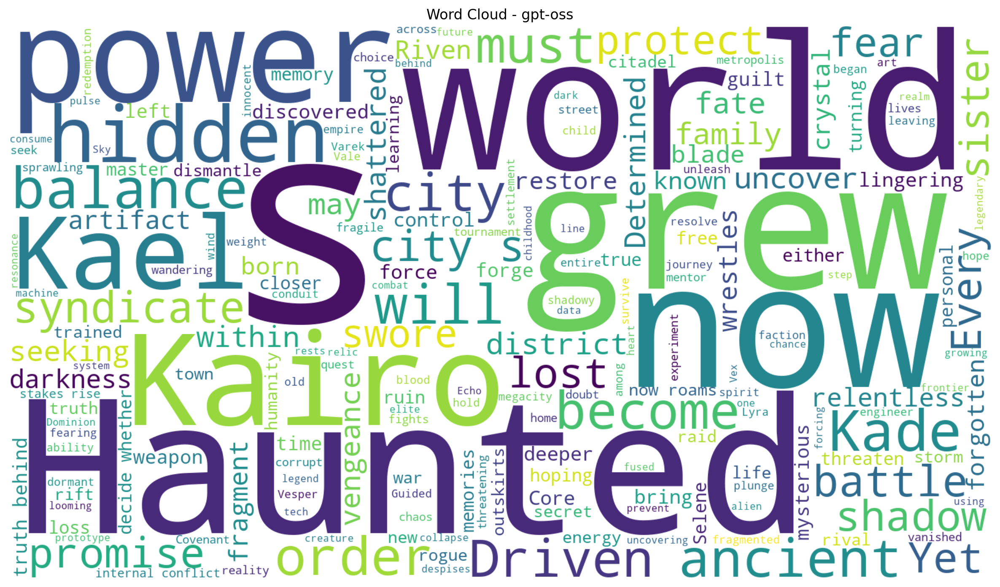

# Towards Democratizing Multi-Modal Game Assets
### LLM-based Generation with Prompt Engineering

[](https://www.python.org/)
[](https://ollama.com/)
[](https://stability.ai/)
[](https://api-docs.igdb.com)
[](LICENSE)

This repository contains the replication package for the paper **"Towards democratizing multi-modal game assets: LLM-based generation with prompt engineering"**.

The goal is to provide indie developers with an **open-source, fully automated pipeline** that generates multimodal game assets — character background stories, skill trees, and visual prompts for concept art and sprite sheets — starting from real game data, without requiring prior knowledge of game design or visual arts tools.


## The Pipeline

The pipeline takes game character data from [IGDB](https://api-docs.igdb.com), obfuscates it to avoid plagiarism, and then uses an LLM to generate a complete character asset package. The generated textual prompts are then passed to **Stable Diffusion SD3.5 Large** to produce visual assets.

```
IGDB API
   │
   ▼
Data Extraction ──► Game Description ──► [LLM] Obfuscation ──► Obfuscated Description
                                                                         │
                                                                         ▼
                                                              [LLM] Character Generation
                                                               ┌─────────┴──────────┐
                                                         Textual Assets        Visual Prompts
                                                     ┌────────┴────────┐           │
                                                Background Story   Skill Tree      ▼
                                                                              [Stable Diffusion]
                                                                          ┌────────┴────────┐
                                                                    Concept Art       Sprite Sheet
```

The three LLMs evaluated in the paper are:

| Model | Architecture | Parameters |
|---|---|---|
| **GPT-OSS-120B** | Mixture-of-Experts | 120B |
| **DeepSeek-v3.1** | Sparse Attention (DSA) | 671B |
| **GLM-5** | MoE + Agentic RL | 744B total / 40B active |

All models were run locally via [Ollama](https://ollama.com/), making the experiment fully reproducible. Experiments were conducted on an NVIDIA A100 80GB GPU.

---

## Repository Structure


Each file in the results directories contains a complete generated character with:
- Character name
- Concept art image prompt (for Stable Diffusion)
- Sprite-sheet image prompt (4 poses: standing, walking, crouching, jumping)
- Background story
- 3-tier skill tree

---

## Results

### Textual Asset Evaluation (BERTScore F1 + Length)

<table>
<tr>
<td></td>
<td></td>
</tr>
<tr>
<td align="center">F1 BERTScore across models</td>
<td align="center">Generated text length vs. originals</td>
</tr>
</table>

All three models produce semantically similar and concise descriptions compared to the originals. GLM-5 shows the tightest distribution with fewer outliers.

### Manual (Qualitative) Evaluation

Three co-authors independently evaluated the generated assets using a Likert scale (1–5) on relevance and originality:

| Model | Background Story (T1) | Skill Tree (T2) | Duplication (T3 — lower is better) |
|---|---|---|---|
| GPT-OSS | 3.68 | 4.10 | 1.62 |
| DeepSeek | 3.53 | 3.98 | 1.63 |
| **GLM-5** | **4.68** | **5.00** | **1.56** |

### Word Clouds (term frequency per model)

<table>
<tr>
<td></td>
<td></td>
<td></td>
</tr>
<tr>
<td align="center">DeepSeek</td>
<td align="center">GLM-5</td>
<td align="center">GPT-OSS</td>
</tr>
</table>

> DeepSeek shows a notable tendency to reuse the name "Kaelen" and motivation-driven tropes across different characters.

### Visual Asset Evaluation (Sprite Sheet Correctness)

| Prompt Source | Crouching | Walking | Standing | Jumping |
|---|---|---|---|---|
| GPT-OSS | 0.01 | 0.45 | 0.70 | 0.08 |
| DeepSeek | 0.07 | 0.40 | **0.94** | 0.07 |
| GLM-5 | 0.08 | **0.77** | 0.91 | **0.21** |

Standing and walking poses are well-represented; crouching and jumping remain an open challenge for SD3.5 Large.

---

## Dataset Download

The full dataset, including generated character files and visual assets, is available for download:

| Resource | Link |
|---|---|
| Generated assets — DeepSeek | [Download Link](https://drive.google.com/file/d/1IZralZU5499x-WZ3lO5k0dG95KwHca2Z/view?usp=sharing) |
| Generated assets — GLM-5 | [Download Link](https://drive.google.com/file/d/1qVYWJoZZfz4IN0acGVk3gvUQm8CY69Ju/view?usp=sharing) |
| Generated assets — GPT-OSS | [Download Link](https://drive.google.com/file/d/1Hx7X-LLsPvY-_WcuG4Uu5kxH7ru1Skw3/view?usp=sharing) |


The base character and game data builds on the [PlayMyData](https://doi.org/10.1145/3643991.3644869) dataset.


## Paper

> *Towards democratizing multi-modal game assets: LLM-based generation with prompt engineering* — 


---

## Related Work

- [PlayMyData](https://doi.org/10.1145/3643991.3644869) — the multimodal video game dataset this work extends
- [GameTileNet](https://ojs.aaai.org/index.php/AIIDE/article/view/36805) — pixel art dataset for procedural content generation
- [LIGS](https://dl.acm.org/doi/10.1145/3706599.3720212) — LLM-infused game system for emergent narrative
- [BenchING](https://ieeexplore.ieee.org/document/10840256) — benchmark for LLMs in narrative game tasks
